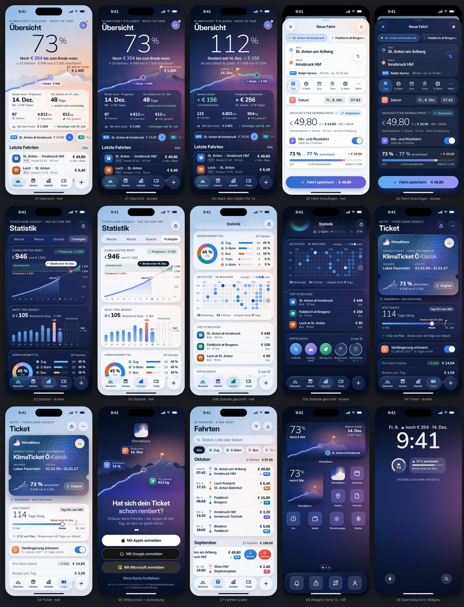

# KlimaBilanz

**Hat sich dein KlimaTicket schon rentiert?** KlimaBilanz ist eine native Premium-iOS-App (SwiftUI, iOS 26, Liquid Glass),
die jede deiner Öffi-Fahrten mit dem regulären Ticketpreis bewertet und dir auf einen Blick zeigt, wie weit dein
Ticket schon „amortisiert“ ist – inklusive Prognose, wann du den Break-even-Gipfel erreichst.

**Design „Alpine Glass“** – Gewinner eines internen Design-Wettbewerbs (3 Richtungen, 3 Juroren): Deine Ersparnis
klettert über ein Arlberg-Panorama zum Gipfel – der Gipfel ist der Ticketpreis, der Break-even der Tag, an dem du die
Fahne hisst. Lebendiger Alpenhimmel (hell „Morgendämmerung“, dunkel „Blaue Stunde“ mit Sternen), Liquid Glass für die
Bedienung, Frost-Karten für Inhalte.

## Funktionen

- **Übersicht** – riesige Amortisations-Anzeige mit „Gipfel“-Grafik, Break-even-Prognose, Kennzahlen, Schnellerfassung
- **Fahrten erfassen in Sekunden** – 1.487 Haltestellen (ÖBB-Fahrplandaten, OSM, Wiener Linien), Lieblingsfahrten,
  „Nochmal fahren“, Hin & Retour, Mitfahrende, Notizen
- **Exakte Normalpreise** – offizielle ÖBB-Relationspreise (26.000+ Verbindungen, Tarif ab 14.12.2025), sonst
  kalibrierte Schätzung nach Bahnkilometern; Kernzonen-Tarife in Städten; Vorteilscard & 1. Klasse
- **Alle KlimaTickets** – KlimaTicket Ö (Klassik/Jugend/Senior/Spezial/Familie, Preise 2021–2026 nach Gültigkeitsbeginn)
  und alle regionalen Tickets aller Bundesländer
- **Statistik** – Ersparnis-Verlauf mit Prognose, Monatsbilanz, Verkehrsmittel, Wochentage, Reise-Kalender,
  Top-Strecken, Rekorde, „Welches Ticket lohnt sich?“, Auto-Vergleich, CO₂-Bilanz
- **Digitales Ticket** – Wallet-Karte mit holografischem Schimmer, Gültigkeit, Verlängerungs-Erinnerungen, Ticket-Jahre
- **Erfolge** – 17 Abzeichen von „Eingestiegen“ bis „Ganz Österreich“
- **Automatische Fahrterkennung** (optional) – erkennt Fahrten zwischen deinen Stamm-Bahnhöfen und schlägt sie vor
- **Widgets, Sperrbildschirm, Kontrollzentrum, Siri & Kurzbefehle** – inkl. interaktiver Schnellerfassung
- **Konten** – Anmeldung mit Apple, Google oder Microsoft, Cloud-Sync zwischen Geräten über ein eigenes, kostenloses
  Cloudflare-Backend (Worker + D1, Daten in der EU) – optional, ohne Konto bleibt alles lokal
- **Updates mit einem Tipp** – neue Versionen werden automatisch erkannt (In-App-Hinweis, AltStore/SideStore-Quelle, TestFlight oder App Store) – ein Tipp, und die App ist aktuell; Ticketpreise aktualisieren sich von selbst
- **Datenschutz** – ohne Konto bleibt alles auf dem iPhone; kein Tracking, keine Werbung

## Installieren

Jeder Build auf GitHub erzeugt eine `.ipa`-Datei (Actions › iOS › Artifacts, bzw. unter Releases).
Installation per AltStore, SideStore, Sideloadly oder TestFlight – Details in [docs/SETUP.md](docs/SETUP.md).

## Entwicklung

- Architektur: [docs/ARCHITECTURE.md](docs/ARCHITECTURE.md) · Design: [docs/DESIGN.md](docs/DESIGN.md) ·
  Design-System-API: [docs/DESIGN_SYSTEM_API.md](docs/DESIGN_SYSTEM_API.md)
- Projekt erzeugen: `brew install xcodegen && xcodegen generate`
- Kernlogik testen (macOS oder Linux): `swift test --package-path Packages/KlimaCore` und
  `swift test --package-path Packages/KlimaCloud`
- Cloud-Backend (Cloudflare Worker + D1): [docs/CLOUDFLARE_BACKEND.md](docs/CLOUDFLARE_BACKEND.md), Einrichtung in
  [docs/SETUP.md §3](docs/SETUP.md), Tests: `cd backend && npm ci && npm test`
- Tarifkatalog neu bauen: `python3 scripts/build_tariffs.py` · Preistabelle: `python3 scripts/build_relations.py`
- Haltestellen/Orte neu bauen: `sh scripts/fetch_places_sources.sh && python3 -I scripts/build_places.py`
  (siehe [docs/DATA_SOURCES.md](docs/DATA_SOURCES.md), Suche: [docs/PLACES.md](docs/PLACES.md))

## Datenquellen

Ticketpreise: klimaticket.at & Verkehrsverbünde · Normalpreise: ÖBB Relationspreise · Haltestellen (alle ~40.000
österreichischen Haltestellen): Mobilitätsverbünde Österreich (Haltestellenverzeichnis, verändert), ÖBB-Personenverkehr
(GTFS, CC BY 4.0), ÖBB-Infrastruktur (CC BY 3.0 AT), Stadt Wien – data.wien.gv.at (CC BY 4.0), Land Steiermark (CC BY 4.0),
Statistik Austria (CC BY 4.0) · Orte: © OpenStreetMap-Mitwirkende (ODbL) · CO₂: Umweltbundesamt.
Details und Lizenzen: [docs/DATA_SOURCES.md](docs/DATA_SOURCES.md).

KlimaBilanz ist ein unabhängiges Projekt und steht in keiner Verbindung zur One Mobility GmbH oder zur ÖBB.
